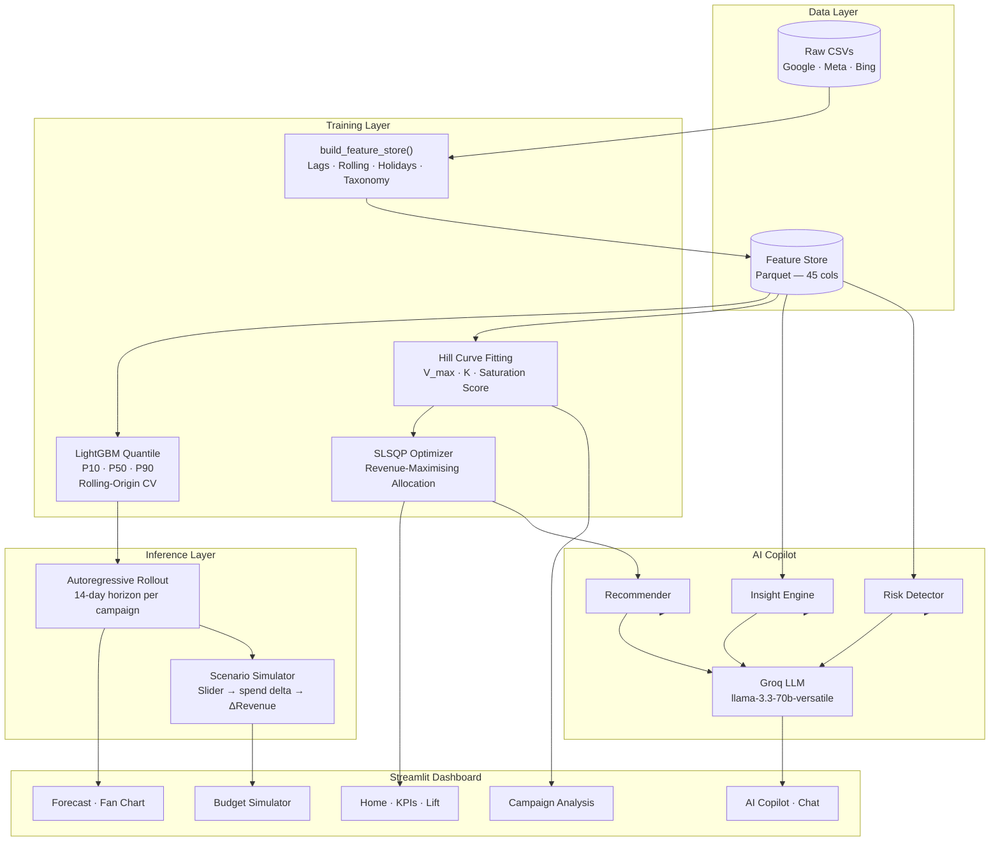

# meridian — Ecommerce Revenue Intelligence Platform

<p align="center">
  
</p>

<p align="center">
  
  
  
  
  
  
  
</p>

<p align="center">
  <strong>AI-powered revenue forecasting, budget optimization, and copilot intelligence<br/>
  for Google Ads · Meta Ads · Bing Ads — all in one Streamlit dashboard.</strong>
</p>

---

> **Hackathon submission** for [NetElixir AIgnition 3.0](https://www.netelixir.com/aignition/).
> meridian turns raw ad platform exports into an end-to-end revenue intelligence system —
> forecast uncertainty, saturation-aware budget optimization, real-time simulation,
> and grounded AI explanations, deployed in a single command.
>
> **Live demo:** [https://meridian-z3nw.onrender.com](https://meridian-z3nw.onrender.com)

---

## What It Does

| Layer | Capability |
|---|---|
| **Forecasting** | LightGBM P10/P50/P90 quantile model + 14-day autoregressive rollout |
| **Budget Optimizer** | SLSQP + Hill saturation curves — maximises revenue at fixed total spend |
| **Budget Simulator** | Interactive sliders → real-time revenue impact across all campaigns |
| **Risk Detection** | Saturation, utilization, concentration, and forecast confidence signals |
| **AI Copilot** | Groq `llama-3.3-70b-versatile` grounded in live campaign data (rule-based fallback included) |

---

## Architecture



---

## Scoring Pipeline (NetElixir AIgnition 3.0)

```bash
./run.sh [DATA_DIR] [MODEL_PATH] [OUTPUT_PATH]

# Defaults:
./run.sh ./data ./pickle/model.pkl ./output/predictions.csv
```

Reads CSVs from `data/`, generates features, runs the model, writes `predictions.csv`. The pipeline drops in held-out test CSVs at `data/` and scores the output.

**Python version: 3.11.9**

---

## How Judges Evaluate This Project

### 1. Automated scoring (CLI pipeline)

The scoring team drops held-out CSVs into `data/` and runs one command:

```bash
git clone https://github.com/arnav-chauhan-kgpian/yoloboy-REVENUE.git
cd yoloboy-REVENUE
pip install -r requirements.txt

# Replace sample data with held-out test CSVs (same schema)
cp /path/to/test/google_ads_campaign_stats.csv  data/
cp /path/to/test/meta_ads_campaign_stats.csv    data/
cp /path/to/test/bing_campaign_stats.csv        data/

# Run the full pipeline
./run.sh ./data ./pickle/model.pkl ./output/predictions.csv
```

Output file: `output/predictions.csv`

| Column | Description |
|---|---|
| `date` | Forecast date |
| `campaign_id` | Campaign identifier |
| `campaign_name` | Campaign name |
| `platform` | `google` / `meta` / `bing` |
| `p10` | 10th-percentile revenue forecast |
| `p50` | Median revenue forecast |
| `p90` | 90th-percentile revenue forecast |

The model (`pickle/model.pkl`) is pre-trained and committed — no training happens at scoring time.

### 2. Live demo (dashboard evaluation)

Open the Streamlit dashboard directly:

**Live demo:** [https://meridian-z3nw.onrender.com](https://meridian-z3nw.onrender.com)

Or run locally:

```bash
python demo.py --demo   # loads pre-built artifacts, starts in <5s
```

The [`docs/JUDGE_GUIDE.md`](docs/JUDGE_GUIDE.md) has a 5-minute walkthrough of all five pages.

---

## Quick Start

```bash
git clone https://github.com/arnav-chauhan-kgpian/yoloboy-REVENUE.git
cd yoloboy-REVENUE
python -m venv .venv && source .venv/bin/activate   # Windows: .venv\Scripts\activate
pip install -r requirements.txt
python demo.py          # trains model + launches Streamlit (~3 min first run)
```

Subsequent launches (artifacts already built):

```bash
python demo.py --demo   # loads artifacts, starts Streamlit in <5s
```

---

## Installation

### Prerequisites
- Python 3.11+
- pip

### Steps

```bash
# 1. Clone
git clone https://github.com/arnav-chauhan-kgpian/yoloboy-REVENUE.git
cd yoloboy-REVENUE

# 2. Virtual environment
python -m venv .venv
source .venv/bin/activate        # macOS / Linux
# .venv\Scripts\activate         # Windows

# 3. Install
pip install -r requirements.txt

# 4. Environment (optional — enables Groq LLM)
cp .env.example .env
# Edit .env: add GROQ_API_KEY=gsk_...
```

---

## Training

### One command (recommended)

```bash
python demo.py
```

Runs the full pipeline: feature store → LightGBM training → Hill curves → optimizer → forecasts → Streamlit.

### Standalone training script

```bash
python run_training.py                # default config
python run_training.py --fast        # n_estimators=200, 2 CV folds (~60s)
python run_training.py --production  # n_estimators=2000, full CV (~10 min)
```

Output:
```
models/
  p10.pkl · p50.pkl · p90.pkl · model_meta.pkl
dataset/
  feature_store.parquet · forecasts.parquet · curves.pkl · opt_result.pkl
evaluation_report.json
```

### Evaluation metrics (typical)

| Metric | Value |
|---|---|
| MAE P50 | < $120/day |
| MAPE P50 | < 8% |
| P10–P90 coverage | > 78% |
| Quantile crossings | 0 |

---

## Inference

Generate fresh forecasts from a trained model:

```bash
python run_inference.py
python run_inference.py --days 30 --future-days 14 --validate
python run_inference.py --output my_forecasts.parquet
```

---

## Streamlit Dashboard

```bash
streamlit run streamlit_app/main.py
```

| Page | What it shows |
|---|---|
| **Home** | Daily revenue, ROAS, optimization lift opportunity |
| **Forecast** | P10/P50/P90 fan chart + 14-day autoregressive projection |
| **Budget Simulator** | Real-time revenue projection when platform budgets change |
| **Campaign Analysis** | Hill saturation curves, budget utilization, TM vs. NTM |
| **AI Copilot** | Grounded AI analysis + conversational chat |

---

## AI Copilot

The AI Copilot page supports two modes:

### Groq LLM (recommended — free tier)

1. Get a free key at [console.groq.com](https://console.groq.com)
2. Add to `.env`: `GROQ_API_KEY=gsk_...`
3. Restart — the badge shows **"Groq AI connected"**

Model: `llama-3.3-70b-versatile` — fast, free tier, no credit card required.

### Rule-based fallback (no key required)

All analytics still work without an API key:
- Data-grounded insights from live campaign signals
- Risk detection (saturation, utilization, concentration)
- Optimizer-backed recommendations
- Natural-language summaries from pre-computed signals

---

## Running Tests

```bash
pytest tests/                                      # all 1050 tests
pytest tests/ --cov=src --cov-report=term-missing  # with coverage
pytest tests/test_scenario_generator.py -v         # single module
```

---

## Project Structure

See [PROJECT_STRUCTURE.md](PROJECT_STRUCTURE.md) for the full annotated file tree.

---

## Hackathon Documentation

See the [`docs/`](docs/) directory:

| Document | Purpose |
|---|---|
| [HACKATHON_OVERVIEW.md](docs/HACKATHON_OVERVIEW.md) | 1-page project summary |
| [TECHNICAL_ARCHITECTURE.md](docs/TECHNICAL_ARCHITECTURE.md) | Deep dive into models and algorithms |
| [DEMO_SCRIPT.md](docs/DEMO_SCRIPT.md) | 5-minute judge demo script |
| [JUDGE_GUIDE.md](docs/JUDGE_GUIDE.md) | How to evaluate the project |

---

## Contributing

See [CONTRIBUTING.md](CONTRIBUTING.md).

---

## License

MIT — see [LICENSE](LICENSE).

---

## Troubleshooting

| Problem | Fix |
|---|---|
| `ModuleNotFoundError: src` | Run from project root |
| `FileNotFoundError: feature_store.parquet` | Run `python demo.py` first |
| Streamlit shows "Demo data not found" | Run `python demo.py` first |
| `--demo` says artifacts missing | Run `python demo.py` (without `--demo`) once |
| Copilot in rule-based mode | Set `GROQ_API_KEY` in `.env` |
| Tests fail with import errors | Run from project root: `pytest tests/` |
| LightGBM install fails | `pip install lightgbm` (needs C++ build tools on Windows) |
